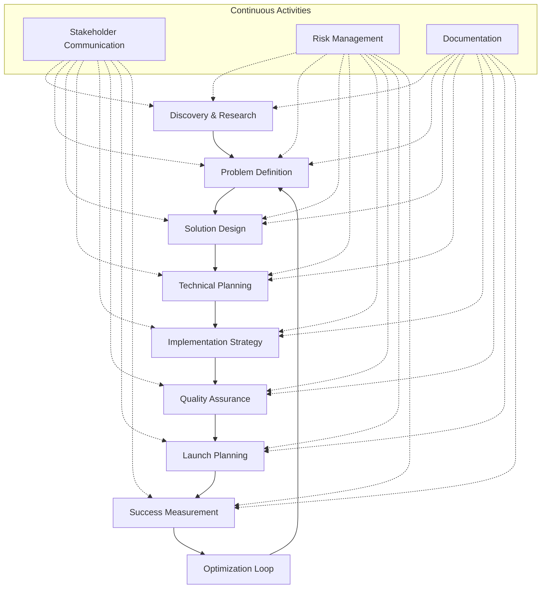
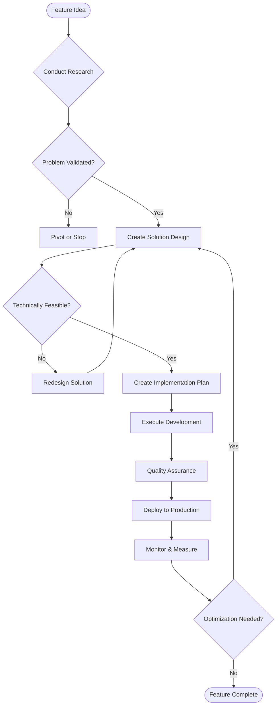
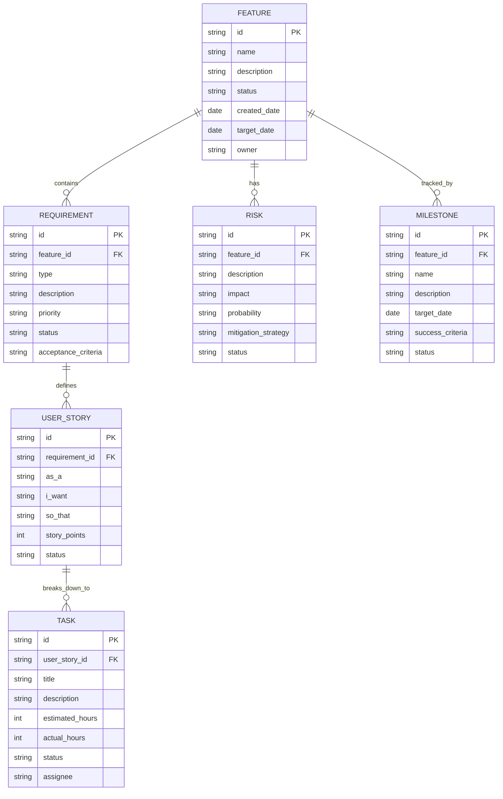
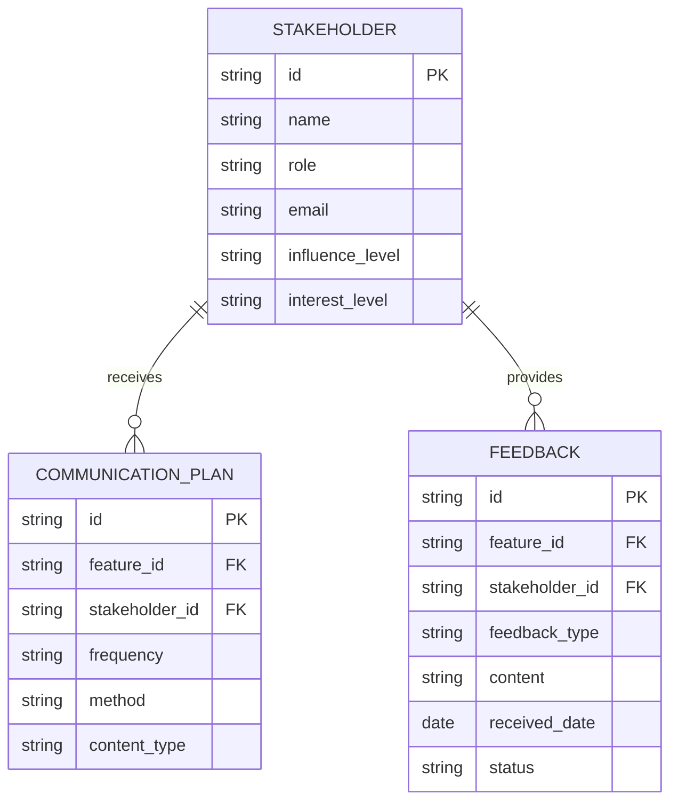

# Feature Planning Template - Design Document

## Overview

This design document outlines a comprehensive methodology for planning any feature from conception to completion. It integrates proven frameworks including Design Thinking, Agile Development, Lean Startup principles, and Product Management best practices to create a systematic approach to feature development.

The methodology follows an 8-phase approach: Discovery → Problem Definition → Solution Design → Technical Planning → Implementation Strategy → Quality Assurance → Launch Planning → Success Measurement.

## Architecture

### Planning Framework Architecture

### Decision Framework

## Components and Interfaces

### 1. Discovery and Research Component

**Purpose**: Gather comprehensive understanding of user needs, market conditions, and technical constraints.

**Key Activities**:
- User interviews and surveys
- Competitive analysis
- Technical feasibility assessment
- Stakeholder requirement gathering

**Deliverables**:
- User persona profiles
- Market research report
- Technical constraint documentation
- Stakeholder requirement matrix

**Tools and Methods**:
- User interview templates
- Competitive analysis frameworks
- SWOT analysis
- Stakeholder mapping

### 2. Problem Definition Component

**Purpose**: Clearly articulate the problem being solved and validate its importance.

**Key Activities**:
- Problem statement creation
- User story mapping
- Impact assessment
- Success criteria definition

**Deliverables**:
- One-sentence problem statement
- User story map
- Business case document
- Success metrics definition

**Validation Methods**:
- Problem-solution fit validation
- User feedback collection
- Market size estimation
- ROI calculation

### 3. Solution Design Component

**Purpose**: Create comprehensive solution architecture covering user experience, system design, and data models.

**Key Activities**:
- User journey mapping
- System architecture design
- Database schema design
- API specification
- UI/UX wireframing

**Deliverables**:
- User flow diagrams
- System architecture diagrams
- Database ERD
- API documentation
- UI wireframes and mockups

**Design Principles**:
- User-centered design
- Scalable architecture
- Security by design
- Performance optimization
- Accessibility compliance

### 4. Technical Planning Component

**Purpose**: Assess technical risks, select appropriate technologies, and create detailed implementation estimates.

**Key Activities**:
- Technology stack evaluation
- Risk assessment and mitigation planning
- Task breakdown and estimation
- Dependency identification
- Infrastructure planning

**Deliverables**:
- Technology decision matrix
- Risk register with mitigation strategies
- Work breakdown structure
- Dependency map
- Infrastructure requirements

**Estimation Techniques**:
- Story point estimation
- Planning poker
- Three-point estimation
- Historical data analysis

### 5. Implementation Strategy Component

**Purpose**: Create detailed roadmap with clear phases, milestones, and delivery strategy.

**Key Activities**:
- Sprint planning
- Milestone definition
- MVP scope identification
- Release strategy planning
- Resource allocation

**Deliverables**:
- Product roadmap
- Sprint backlog
- Milestone timeline
- MVP specification
- Release plan

**Methodologies**:
- Agile/Scrum framework
- Kanban workflow
- Feature flag strategy
- Continuous integration/deployment

### 6. Quality Assurance Component

**Purpose**: Ensure comprehensive testing coverage and quality standards throughout development.

**Key Activities**:
- Test strategy development
- Test case creation
- Automation planning
- Performance testing design
- Security testing planning

**Deliverables**:
- Test strategy document
- Test case repository
- Automation test suite
- Performance test plan
- Security test checklist

**Testing Types**:
- Unit testing
- Integration testing
- User acceptance testing
- Performance testing
- Security testing
- Accessibility testing

### 7. Launch Planning Component

**Purpose**: Prepare for successful feature launch with proper monitoring, communication, and support.

**Key Activities**:
- Go-live criteria definition
- Monitoring setup
- User communication planning
- Support material creation
- Rollback procedure planning

**Deliverables**:
- Launch checklist
- Monitoring dashboard
- User documentation
- Support runbook
- Rollback procedures

**Launch Strategies**:
- Blue-green deployment
- Canary releases
- Feature flags
- Gradual rollout
- A/B testing

### 8. Success Measurement Component

**Purpose**: Monitor feature performance, gather feedback, and plan continuous improvements.

**Key Activities**:
- Metrics tracking
- User feedback collection
- Performance monitoring
- Data analysis
- Optimization planning

**Deliverables**:
- Analytics dashboard
- User feedback reports
- Performance reports
- Optimization backlog
- Success assessment

**Key Metrics**:
- User adoption rates
- Feature usage analytics
- Performance metrics
- User satisfaction scores
- Business impact metrics

## Data Models

### Planning Artifact Data Model

### Stakeholder Communication Model

## Error Handling

### Planning Process Error Handling

1. **Incomplete Requirements**
   - Validation checkpoints at each phase
   - Stakeholder sign-off requirements
   - Automated completeness checks

2. **Scope Creep Management**
   - Change request process
   - Impact assessment procedures
   - Stakeholder approval workflows

3. **Technical Risk Mitigation**
   - Regular technical reviews
   - Proof of concept development
   - Alternative solution planning

4. **Timeline and Budget Overruns**
   - Regular progress monitoring
   - Early warning systems
   - Contingency planning

5. **Quality Issues**
   - Continuous testing integration
   - Quality gates at each phase
   - Automated quality checks

## Testing Strategy

### Planning Validation Testing

1. **Requirements Validation**
   - Stakeholder review sessions
   - User story validation workshops
   - Acceptance criteria verification

2. **Design Validation**
   - Technical architecture reviews
   - User experience testing
   - Prototype validation

3. **Implementation Plan Testing**
   - Estimation accuracy tracking
   - Risk assessment validation
   - Resource availability verification

4. **Process Effectiveness Testing**
   - Planning methodology retrospectives
   - Success rate analysis
   - Continuous improvement implementation

### Quality Metrics

- Requirements completeness score
- Stakeholder satisfaction rating
- Estimation accuracy percentage
- Risk mitigation effectiveness
- Timeline adherence rate
- Budget variance percentage
- Feature adoption rate
- User satisfaction score

## Implementation Guidelines

### Phase Gate Approach

Each phase must meet specific criteria before proceeding:

1. **Discovery Gate**: User needs validated, market research complete
2. **Problem Gate**: Problem statement approved, business case validated
3. **Design Gate**: Solution design reviewed, technical feasibility confirmed
4. **Planning Gate**: Implementation plan approved, resources allocated
5. **Development Gate**: Quality standards defined, testing strategy approved
6. **Launch Gate**: Go-live criteria met, monitoring in place
7. **Success Gate**: Success metrics achieved, optimization plan created

### Continuous Activities

Throughout all phases:
- Regular stakeholder communication
- Risk monitoring and mitigation
- Documentation maintenance
- Progress tracking and reporting
- Quality assurance activities

### Adaptation Guidelines

This methodology should be adapted based on:
- Project complexity and size
- Team experience and capabilities
- Organizational constraints
- Timeline and budget limitations
- Risk tolerance levels